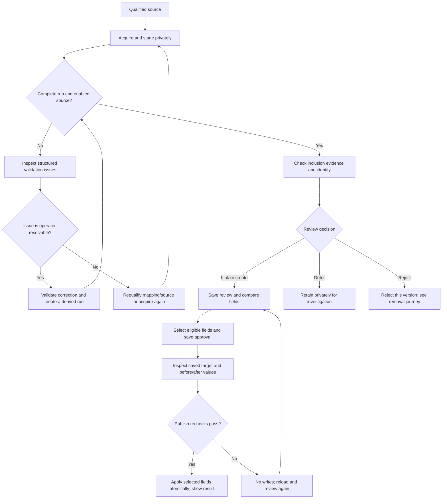
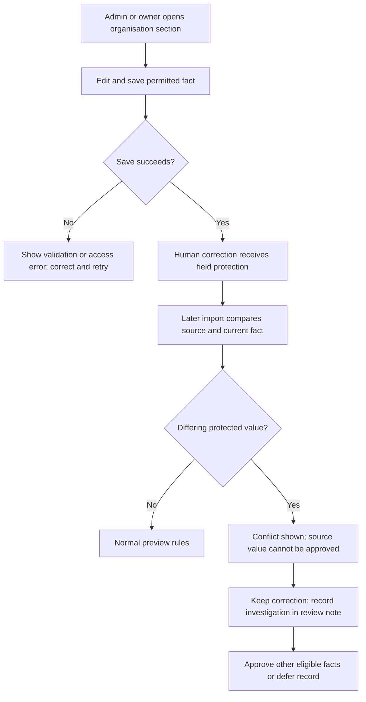
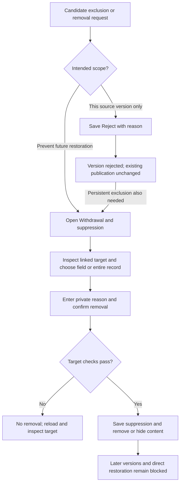

# P05 core journey sketches

Version: 1.1. Updated: 23 September 2026. Scope: reviewable workflow sketches
for import, correction and removal. These are low-fidelity screen contracts,
not a UI implementation or a claim that every later milestone is complete.

The sketches follow the [P01 inclusion policy](pilot-inclusion-policy.md), the
[P34a staged-validation decision](staged-validation-resolution.md) and
[P04 qualified samples](source-sample-qualification.md). **Existing** means a path
is present in the repository; **proposed** means follow-up implementation. Screen
blocks simplify existing layouts; illustrative values below are invented.

## Actors and entry points

| Actor                    | Entry and responsibility                                                                                          | Boundary                                                                                 |
| ------------------------ | ----------------------------------------------------------------------------------------------------------------- | ---------------------------------------------------------------------------------------- |
| Public reader            | Organisation pages: read published facts, sources and dates                                                       | Cannot see raw evidence, review notes or removal reasons                                 |
| Organisation member      | Read records permitted by their organisation role                                                                 | Membership alone does not permit editing or import review                                |
| Organisation admin/owner | Existing organisation section forms: correct permitted facts; platform administrators have effective owner access | Organisation authority alone does not grant global ingestion access                      |
| Data Steward             | Admin → focused ingestion queues: validate, match, approve, publish and suppress                                  | Server/database capability checks apply; an import does not grant organisation ownership |
| Platform administrator   | Admin → Source approvals and acquisition configuration                                                            | Source enablement and scheduling are separate from record approval/publication           |

The [P06 capability matrix](capability-matrix.md) expands these task boundaries
and records the remaining P07/P08 implementation and verification requirements. Existing operator checks include
the database's authentication/MFA requirements. Permission failures stop the
action; the UI must not suggest retrying under an organisation role as a bypass.

## Journey 1: import → match → field review → publish

**Goal:** publish only reviewed facts for an eligible, correctly identified
organisation. Start with an approved source and end with a publication result
and an organisation link. Everything before publication stays in private staging.



### A. Acquire and inspect the run

```text
Admin / Acquisition jobs                         [Ingestion queues]
Source: ACNC Register   Status: Enabled   Schedule: Off
Scope: configured pilot postcode
[Queue acquisition]

Job          Status       Attempt     Result
Selected job Complete     1           [Open run]

Identity and eligibility / Run
Source + resource | observed date | completion | reprocessing origin
Staged records: [record name / native ID / review decision]
```

**Existing:** bounded ACNC jobs at `/admin/ingestion/jobs`, source controls at
`/admin/sources`, and run selection at `/admin/ingestion/identity`. A queued or completed
job does not publish. Failed/partial acquisition retains diagnostic evidence;
incomplete runs cannot approve or publish. A paused source requires administrator
review; enabling it does not repair an incomplete run. Preserve the run/record
context when returning from Source approvals.

**Approved follow-up, P34a:** every staged source exposes accepted, held and
quarantined counts plus structured field/record issues through the shared
[validation-resolution workflow](staged-validation-resolution.md). The input sketch
is:

```text
Approved CSV import
Source / resource / export version / observation date
Permission evidence / attribution / scope / mapping version
[Choose CSV] [Validate and stage privately]
Result: candidates | held | quarantined | file errors
[Inspect validation issues] [Open staged run]
```

Reject invalid file metadata/headers before staging. Retain recoverable malformed
rows with reasons; unrecoverable record boundaries fail the file. Quarantine is a
validation outcome, distinct from an operator's rejection. The P04 CSV fixture is
development-only and cannot be published. A real provider needs qualification.

The validation view shows the immutable raw value and record context, issue code,
category, validator and permitted decisions. An operator may correct a value, omit
a mapping-declared optional field, defer it or reject the record. Proposed values
must pass the authoritative server validator. Scope, schema, licence, mapping and
acquisition failures are diagnostic only and cannot be manually accepted.

```text
Validation queue
Source + run/release | blocking/deferred/non-resolvable counts | filters
Record and field | raw value | failure reason | validator/version
[Open safe candidate] [Enter correction] [Validate proposed value]
Decision: [Correct / Omit optional field / Defer / Reject record]
Evidence note: [required]
[Save decision] [View decision history]

All blocking issues resolved and raw hashes unchanged
[Create corrected run]
Result: new derived run; original partial run remains unchanged
```

Creating a corrected run revalidates every affected record and field. It preserves
the original observation and lineage, cannot manufacture complete-snapshot absence,
and enters identity/field review only if the new run has zero quarantine and zero
acquisition errors. Resolution and replay never approve or publish data.

### B. Check inclusion and matching

```text
Identity and eligibility / Selected source record
Source, native ID, observation date, assertions, current source link
Possible matches: [Search name or ABN] [Search]
Candidate: name | ABN | address     [Compare fields] [View organisation]
[Preview as a new organisation]

Decision: [Link existing / Create new / Defer / Reject this version]
Organisation: [select only for Link]
Review note: [identity and inclusion evidence, decision reason]
[Save review]
Result: Review saved. Publication requires a separate step.
```

**Existing:** compare/search and reasoned decisions on the review page. Comparing
a candidate changes the preview, not the saved decision. Save the intended target
before approving fields. Record P01 version, geographic basis, community category,
entity/group/service classification, evidence reference/date and reason in notes.
Structured inclusion fields remain proposed.

An existing source link is the first identity clue. Check supported identifiers;
a matching name or shared ABN alone never authorises a merge. ABN format is not
registry verification. Branches, service names, contradictory identifiers and
uncertain geography go to **Defer** until resolved. A new candidate without an ABN
can qualify. Saving **Create** does not yet create a public organisation.
P11/P14/P16 own richer entity mapping, deterministic matching and exact-ABN checks.

### C. Review fields and publish

```text
Field change preview — saved target: Example Community Group
Groups: Overview | Legal | Contact | Operations | Finance | Governance
Field       Current                Source                 Status     Select
Website     blank                  https://example.org    new        [x]
Name        Example Community Group Same value            unchanged  disabled
ABN         human correction       different ABN          conflict   disabled
Address     [all current parts]     [merged address parts] changed    [ ]
[Select eligible fields in group]   [Save field approval]

Saved field approvals
Target: existing organisation / New public organisation
Selected fields: saved before → after values
[Publish these approved fields] [Close]
Result: Published + time + [View organisation]
```

**Existing:** grouped review covers all 62 ACNC review units. Select only eligible
fields; group selection excludes ineligible values. A new organisation requires
Entity name. Address changes are one atomic review unit with the complete merged
diff; flags are individual facts. Missing source values never imply clearing a
field. False and zero remain meaningful values. Source financial categories or
year-end dates must not be presented as a budget.

Conflicting/protected, missing, invalid, ambiguous, unmapped and suppressed values
cannot be used to bypass the publication gates. Saving approval captures selected
values and revisions; it opens the saved-approval dialog without publishing.
Publishing checks source/run eligibility, saved identity decision, suppression and
current target snapshots again. A stale target, changed review or intervening edit
requires reloading and fresh approval; failure applies none of the selected writes.

Successful creation makes a **new public organisation**, with no role grant to the
operator. Publication to an existing organisation preserves its visibility; the
result link alone is not proof that a private organisation is publicly readable.
Retrying the same successful approval returns its recorded result without duplicate
writes. Public pages show approved facts, attribution and observation/publication
dates, while private evidence and decision reasons stay private. Broader batch
summaries and stale-status presentation remain P19/P20 follow-ups.

## Journey 2: organisation edit → conflict review

**Goal:** let an authorised editor correct a fact and preserve it when the source
next differs. Editors use organisation forms; operators encounter conflicts in the
existing import field preview. There is no separate implemented conflict inbox.



```text
Organisation / Contact
Website: [https://corrected.example.org]
[Save]     Result: saved, or actionable validation error

Later: Import review / Contact
Website
Current: https://corrected.example.org
Source:  https://old.example.org
Status: Conflict — protected portal value; selection unavailable
Review note: [reason for retaining correction / investigation evidence]
[Save review] [Approve other eligible fields]
```

**Existing:** organisation-scoped editor checks, database field protection and
conflict previews. Protection includes human clears/deletions, so a null current
value is not automatically a gap the importer may fill. An edit after approval
makes a conflicting publication stale; reusing that approval must not overwrite it.
Public attribution can identify a source observation changed in the portal.

**Proposed, P19/P21/P27:** a dedicated conflict resolution workflow with explicit
keep/resolve decisions and history. Today, retain the human value and document the
investigation, or defer; there is no operator unlock or “force source value” action.
An authorised organisation editor may independently correct a supported form field
after investigation, but that is a human edit, not an ingestion override. Do not
promise editing every imported projection through current forms. Review notes
record context; they are not a structured per-field conflict-resolution state.

## Journey 3: reject/withdraw → suppress

**Goal:** distinguish a rejected version from a lasting block, and make the exact
public impact visible before removal. Entry: the selected record in the suppression queue,
including a previously published record linked to an existing organisation.



```text
Withdrawal and suppression
Target: linked organisation ID / Unpublished source record
Existing suppressions: scope | date | private reason
Scope: [Field / Entire record]
Current value: [displayed for selected field on linked target]
Reason (private): [required]
[ ] I confirm removal of the selected content and blocking its restoration.
[Apply suppression]
Result: suppression saved, or reload-and-review error
```

**Existing:** this panel and confirmation. **Reject this version** is a review
decision, not a delete or a persistent suppression. A changed source version needs
fresh review; rejection does not withdraw earlier published content. If exclusion
must survive later versions, apply suppression explicitly with the correct scope.

| Removal scope                          | Result and review requirement                                                                                                                                |
| -------------------------------------- | ------------------------------------------------------------------------------------------------------------------------------------------------------------ |
| Unpublished source record or field     | Block future publication of the selected scope; no public organisation is created                                                                            |
| Field on a linked organisation         | Clear the current fact, including human corrections; inspect the displayed value first. Suppression covers that target fact across source projections        |
| Entire record, or required Entity name | Withdraw the whole linked organisation from public view, even if it existed before import; do not describe this as removing only one provider's contribution |

The suppression target comes from the source record's link, not an arbitrary
candidate currently being compared. Field removal checks the displayed snapshot;
changed or ambiguous targets require reloading. Private reasons and audit evidence
remain private. Withdrawal hides rather than erases the organisation: authorised
private access can remain. There is no restore/unsuppress UI. The block survives
later versions of the same source identity and prevents restoring the suppressed
target; it does not identify duplicates under unrelated native/resource IDs.

Missing from a refresh, a failed source request or a partial run does not establish
closure and must not trigger withdrawal. P27 owns broader reconciliation semantics.
Suppression does not erase private raw archives, audit history or external caches;
provider-required all-copy deletion needs its own retention/removal workflow.

## Walkthrough acceptance and implementation handoff

These are review scenarios for the sketches and future UI work, not newly executed
browser/database tests. Use synthetic records for destructive scenarios.

| Walkthrough                                               | Expected stopping point or result                                                                                          |
| --------------------------------------------------------- | -------------------------------------------------------------------------------------------------------------------------- |
| Eligible no-ABN group, such as P04 csv-001                | Check evidence, propose create, require name approval, publish only after all gates; fixture itself stays development-only |
| Shared-ABN branch or same-name candidate, csv-003/csv-005 | Defer ambiguous identity; no automatic merge or duplicate creation                                                         |
| Malformed CSV row, csv-006–008                            | P12 quarantine with a reason; no public change                                                                             |
| Paused source or incomplete run                           | Explain the blocked approval and route to source review or a new complete import                                           |
| Only website selected                                     | Saved approval and publication include only that eligible fact                                                             |
| Editor changes a field after approval                     | Publication fails atomically; reload, show protected conflict, retain correction                                           |
| Same approval submitted again                             | Return recorded publication without duplicate entities or writes                                                           |
| Reject a previously published version                     | Earlier publication remains; persistent removal requires explicit suppression                                              |
| Suppress corrected field, then replay source              | Clear the confirmed value and block restoration                                                                            |
| Withdraw pre-existing linked organisation                 | Hide whole organisation; later import cannot make it public                                                                |
| Unauthorised visitor opens review or submits an action    | Deny private read/mutation; show no raw evidence or private reason                                                         |

Follow-up UI work should retain labelled controls, keyboard access, textual status
and errors, and a readable stacked current/source comparison on narrow screens.
Keep selection and review context clear after errors; require a fresh comparison
when snapshots change. These are design requirements, not an accessibility audit.

P05 is complete as a written journey/sketch deliverable. It does not complete the
proposed CSV importer, entity mapping, conflict resolution or reconciliation work.
Implementation references checked for this document:

- [Ingestion queue index](../src/routes/admin/ingestion/+page.svelte),
  [identity decisions](../src/routes/admin/ingestion/identity/+page.server.ts),
  [field changes](../src/routes/admin/ingestion/changes/+page.server.ts) and
  [suppression decisions](../src/routes/admin/ingestion/suppressions/+page.server.ts).
- [Saved approvals](../src/components/ingestion/SavedApprovals.svelte) and
  [withdrawal controls](../src/components/ingestion/WithdrawalControls.svelte).
- [Organisation edit actions](../src/routes/organisations/[id]/+page.server.ts)
  and [authorization](../src/lib/server/authorization.ts).
- [Field coverage and publication progress](import-field-coverage-plan.md),
  [private staging history](private-staging.md) and
  [current acquisition controls](acquisition-jobs.md).
