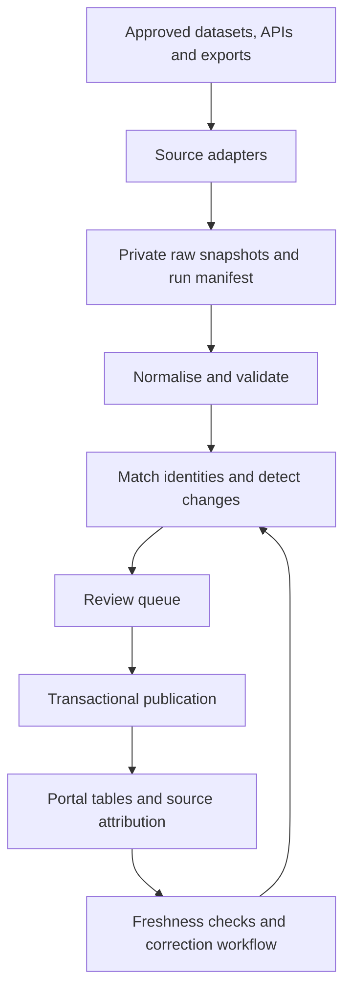

# Public-source data ingestion and maintenance strategy

Prepared: 15 September 2026. Updated: 16 September 2026 after acquisition-code review.
Status: proposed implementation plan.

## 1. Recommended approach

Build a source-aware ingestion service that collects permitted public data into
private staging, matches it to existing organisations, proposes field changes and
publishes reviewed updates. Start with ACNC data and ABN verification, then add NSW
incorporated associations and selected sector directories.

Use bulk downloads and documented APIs first. Add provider-approved exports next.
Use website extraction only where access and reuse conditions permit it. Public
visibility alone is insufficient evidence that a whole directory can be copied
and republished.

The first release should cover a manageable region and several sectors. Based on
[Content.md](Content.md), the suggested pilot is Snowy Valleys and nearby communities,
with its exact boundary recorded in configuration. National source adapters should
be reusable when coverage expands. Geography is an assumption for this plan, not
a confirmed restriction on the project.

The design below is a recommendation. Source availability statements are linked
to publisher material; unconfirmed access methods are explicitly identified.
No accounts were registered, providers contacted, datasets ingested or paid services
ordered while preparing this plan.

## 2. Source strategy

| Source                                              | Best role                                                               | Access and evidence                                                                                                                                                                                                                                                                                              | Initial adapter                                                                                                                                                                                               |
| --------------------------------------------------- | ----------------------------------------------------------------------- | ---------------------------------------------------------------------------------------------------------------------------------------------------------------------------------------------------------------------------------------------------------------------------------------------------------------- | ------------------------------------------------------------------------------------------------------------------------------------------------------------------------------------------------------------- |
| ACNC Charity Register                               | Discover registered charities; verify charity identity and status       | ACNC directs multi-charity users to its downloadable Register and Annual Information Statement datasets. The latter are released by reporting year and updated weekly. Withheld information is excluded. [ACNC downloads](https://www.acnc.gov.au/charity/about-charity-register/download-charity-register-data) | Download the current Register resource; parse its documented schema. Add AIS resources separately, preserving reporting periods.                                                                              |
| ABN Lookup public bulk extract                      | Match and enrich legal entities at scale                                | Weekly XML extract includes identifiers, names, status, entity type, main-location state/postcode, GST and DGR information. It is a subset of public ABN data. [Bulk extract](https://abr.business.gov.au/Tools/BulkExtract)                                                                                     | Stream XML when volume warrants it; use the public extract, not restricted ABR agency products.                                                                                                               |
| ABN Lookup web services                             | Verify known ABNs and resolve selected candidates                       | Free access requires registration and an authentication GUID. SOAP/HTTP methods and limited JSON support are documented. [Web services](https://abr.business.gov.au/Tools/WebServices)                                                                                                                           | Server-side lookup client with caching, request limits and retries. Prefer exact ABN queries; use name queries to generate candidates.                                                                        |
| NSW Fair Trading Incorporated Associations Register | Discover/verify incorporated associations, including non-charities      | Public search provides name, incorporation number, incorporation date and status. [Register description](https://www.nsw.gov.au/business-and-economy/incorporated-associations/nsw-incorporated-associations-register), [search](https://applications.fairtrading.nsw.gov.au/assocregister/)                     | Begin with a provenance-bearing CSV import for authorised exports/manual research. Confirm bulk/API access and reuse before building automated collection. No public bulk API was established in this review. |
| Landcare Australia National Landcare Directory      | Discover environmental groups and enrich activities/contact information | Community-maintained directory; publisher says not all groups are listed. [Find a Group](https://landcareaustralia.org.au/find-a-group/)                                                                                                                                                                         | Seek a licensed feed/export; otherwise assess permitted extraction for a bounded pilot. No documented public API or bulk-reuse licence was confirmed here.                                                    |
| ANHCA and state neighbourhood-house peaks           | Discover centres and regional/state coverage                            | ANHCA's report identifies its state peak-body network. This supports a federated source list rather than assuming one national downloadable register. [ANHCA network](https://www.anhca.org/_files/ugd/a2ae1f_609f99afe2aa4bccb58dbcb34de7d364.pdf)                                                              | Select one state directory first, such as the NSW network; confirm export/reuse arrangements for each provider.                                                                                               |
| State sports associations                           | Discover clubs and verified affiliations                                | NSW Office of Sport lists recognised state organisations, providing a starting point for provider discovery. Its displayed list is dated August 2024. [Recognised organisations](https://www.sport.nsw.gov.au/recognised-state-sporting-organisations-nsw)                                                       | One adapter per approved club directory or shared provider format. Start with two sports relevant to the pilot.                                                                                               |
| Arts and recreation networks                        | Fill gaps beyond statutory registers                                    | Regional Arts NSW describes its network of regional development organisations. [Arts network](https://regionalartsnsw.com.au/about-the-network/)                                                                                                                                                                 | Use network sites to identify relevant regional directories; qualify each as a separate source. Filter organisations from individual artists, venues and events.                                              |
| My Community Directory                              | Enrich services, locations, categories and contact details              | Its platform terms describe the Community Information Exchange API and say partner organisations can request access; attribution requirements may apply. [Platform terms](https://www.mycommunitydirectory.com.au/Resources/Terms_and_Conditions)                                                                | Partner API adapter after obtaining documentation and an agreement covering storage, republication, refresh and removal. Do not assume unrestricted public API access.                                        |
| Other jurisdictions and local information services  | Extend geographic and sector coverage                                   | Access and identifiers differ by provider; no universal Australian community-directory API is assumed                                                                                                                                                                                                            | Use the same source onboarding process for each state register, council directory and peak body.                                                                                                              |

### Source onboarding record

P04 records the [qualified ACNC sample, synthetic CSV contract and ABN access
handoff](source-sample-qualification.md). The CSV fixture is for development only;
real exports still need provider-specific access and schema qualification.

Before enabling an adapter, record its publisher, dataset/resource identifiers,
URLs, format, geographic coverage, fields, update cadence, access method,
credentials reference, rate limits, licence/terms URL and version, attribution,
permitted storage and republication, removal obligations and technical contact.
Keep `access_status` as `research`, `approved`, `paused` or `retired`.

Check licences at the **dataset/resource level**. For example, the ACNC user-notes
resource and ABN extract readme metadata list CC BY 3.0 Australia, while the latter
page also has a generic CC BY 4.0 site footer. Resolve applicable resource terms
before enabling publication rather than choosing the footer licence.
[ACNC resource metadata](https://data.gov.au/data/en/dataset/acnc-register/resource/8687e783-a9de-4431-a8fc-d677bc475c03),
[ABN resource metadata](https://data.gov.au/data/dataset/abn-bulk-extract/resource/3b975e4f-af2f-4de7-a20e-6dcb3f67805c).

ABN web-service terms also require action when information is withdrawn: design
removal handling into the service, not just its public page.
[ABN agreement](https://abr.business.gov.au/Tools/WebServicesAgreement).

## 3. Define which records belong in the portal

Maintain separate concepts for:

- **Legal entity:** the organisation holding an ABN or incorporation registration.
- **Community group or branch:** a local group that may have no ABN or share a parent entity.
- **Service:** an offering delivered by an organisation, potentially at multiple sites.
- **Location:** a physical service site, postal contact or administrative address.

Do not require every community group to have an ABN. Conversely, an ABN does not
by itself establish that a business belongs in the community directory. Charity
registration, incorporation and current service operation are separate facts.

Use an explicit inclusion policy: relevant community purpose, geographic coverage
and evidence from an accepted source. Treat uncertain records as candidates.
Exclude individual people, commercial suppliers without a relevant community role,
events and directory category pages from automatic organisation creation.

Support both `located_in` and `serves_area`. A national charity can serve the pilot
region without its headquarters being there. A postcode is a discovery hint, not
proof of local service coverage or an exact local-government boundary.

Create a modest shared taxonomy: sport, arts/culture, recreation, environment,
neighbourhood/community centres, welfare/support, health, education, service clubs
and other. Preserve each provider's original categories and the mapping version.

## 4. Architecture and toolset



### Repository implementation

Use adapted **Python acquisition modules** from `orgs-sveltekit-etl`, supplemented
by the regional configuration and parser checks in `orgs-data-manager`. Keep
SvelteKit/TypeScript for operator authorization, review and job management. The
[acquisition assessment](acquisition-code-assessment.md) pins the reviewed commits,
identifies reusable modules and lists fixes required before reuse. This supersedes
the original proposal to write all adapters in TypeScript.

```text
tools/ingestion/python/
  pyproject.toml
  upstream-manifest.json
  ingestion/cli.py
  ingestion/adapters/             # adapted ACNC, ABN and NSW clients; new CSV adapter
  ingestion/normalise/            # corrected source mappings
  tests/fixtures/
src/lib/server/ingestion/          # authorised jobs, matching, review/publication
src/routes/admin/ingestion/        # source/run/review screens
supabase/migrations/              # staging, provenance and publication schema
```

Selectively vendor the source clients with provenance; do not import the Flask
application, Redis dependency or direct Supabase loader. The worker writes a
versioned JSON/JSONL contract to private staging, including source/native IDs,
raw references, assertions, scope and explicit completion state. Validate the
contract on both sides with shared fixtures. Build publication as a separate
transactional operation.

The existing ACNC client supports filtered CKAN queries. Qualify its current
resource/schema before use, and retain bulk download as the preferred full-snapshot
path. Existing ABN charity search is not a complete community-organisation discovery
method. Adapt exact ABN lookup first. The NSW scraper is a useful implementation
basis but still requires access/reuse qualification and current-markup testing.
AIS, national bulk ABN and sector-directory adapters remain additional work.

These paths and commands are proposed, not existing tools:

| Command                                                          | Function                                                       |
| ---------------------------------------------------------------- | -------------------------------------------------------------- |
| `ingest sources validate`                                        | Check configuration, access approval and required credentials  |
| `ingest fetch --source acnc-register`                            | Fetch one version and write a manifest/checksum                |
| `ingest import-file --source nsw-associations --file export.csv` | Stage an approved file with provenance                         |
| `ingest normalise --run RUN_ID`                                  | Parse, validate and quarantine malformed records               |
| `ingest match --run RUN_ID`                                      | Generate candidate matches with reasons                        |
| `ingest diff --run RUN_ID`                                       | Produce a reviewable create/update/conflict/withdrawal report  |
| `ingest publish --batch BATCH_ID`                                | Apply only approved changes with revision checks               |
| `ingest reconcile --source SOURCE_ID`                            | Compare a complete successful snapshot with prior records      |
| `ingest rollback --batch BATCH_ID`                               | Reverse attributable changes where later edits do not conflict |

Each adapter implements discovery/fetch/parse with a stable source ID and parser
version. Normalisation, matching and publication are shared. Manual files pass
through the same pipeline rather than bypassing review.

Run large downloads and XML parsing in a scheduled worker/container. Keep the
existing [cron endpoint](../src/routes/api/cron/+server.ts) focused on short jobs;
it can eventually enqueue work, but should not process a national extract inside
one HTTP request. Select hosting based on measured pilot memory, runtime and cost.
Use a database-backed job table initially; leases and checkpoints allow safe retries.

## 5. Schema additions and mapping

The current [schema](../supabase/migrations/20260101000000_baseline_community_orgs_schema.sql)
already separates organisation, legal, contact, operational and financial data.
It lacks the provenance, source identity and review structures needed for ingestion.

### Add a private ingestion schema

| Table                    | Essential contents                                                                                                         |
| ------------------------ | -------------------------------------------------------------------------------------------------------------------------- |
| `sources`                | Access policy, licence, attribution, cadence, adapter configuration                                                        |
| `ingestion_runs`         | Source, started/completed timestamps, status, cursor, scope, counts, parser version                                        |
| `source_records`         | Source-native ID, raw object reference, content hash, observed/source-modified timestamps, last-seen run, withdrawal state |
| `source_record_versions` | Versioned permitted snapshots, schema version and retention deadline                                                       |
| `record_links`           | Mapping of source record to legal entity/group/service/location; decision and reviewer                                     |
| `field_assertions`       | Field/value, source version, effective/reporting period, confidence, supersession and publication eligibility              |
| `change_sets`            | Proposed values, previous values/revisions, reasons, approval state and reviewer                                           |
| `publication_events`     | Exact applied changes, actor/job, batch ID and reversible history                                                          |
| `suppression_rules`      | Source/record/field restrictions preventing republishing withdrawn data                                                    |

Enforce uniqueness on `(source_id, source_native_id)` and idempotent version hashes.
Keep raw payloads in private object storage, with paths/hashes in Postgres. Version
history is subject to withdrawal and retention rules; it is not an immutable archive
of information the provider requires deleted.

### Extend the public domain model

- Add identifiers with `scheme`, `jurisdiction`, `value`, validity and verification
  source. ABNs and incorporation IDs are strings; namespace state registration IDs.
  Apply unique verified ABNs to **legal entities**, not indiscriminately to branches.
- Add an explicit parent/legal-entity link or scoped relationship model for branches;
  do not force a service listing into a duplicate organisation row.
- Add publication/lifecycle states: candidate, reviewed, published, stale, archived.
  Keep operational closure separate from each register's status.
- Add categories, structured localities/service areas and address roles. Keep
  geocoding source, precision and rights with coordinates.
- Add field ownership/revisions so imports cannot silently overwrite owner/editor
  changes. Expose only safe citation summaries to public users.
- Add reporting-period financial observations before importing AIS financial values.
  The existing `annual_budget` is not a destination for reported actual revenue.

### Mapping rules

| Source fact                            | Destination or handling                                                                                      |
| -------------------------------------- | ------------------------------------------------------------------------------------------------------------ |
| Legal name                             | `organisations.entity_name` for the matched legal entity, with source assertion                              |
| Business/trading names                 | `aliases`, preserving type; extend the enum for historical/other names only if needed                        |
| ABN and ABN status                     | Verified identifiers plus `legal_details.abn`/status projection                                              |
| Charity status/dates                   | ACNC-specific legal fields and retained source-native status                                                 |
| NSW incorporation number/date/status   | Jurisdiction-scoped identifier plus incorporation fields; retain full statuses such as cancelled/amalgamated |
| Postal/main business locality          | Structured administrative location; do not invent a street address or service area                           |
| Organisation website/general contact   | Contact assertions; promote after identity and publication checks                                            |
| Services, opening hours, accessibility | Program/service and operational records, preserving service/site scope                                       |
| AIS revenue/staff/volunteers           | Period-specific observations; do not overwrite current values without an explicit current-value policy       |
| Registration dates                     | Registration fields; never infer `date_established` from ABN activation alone                                |

Use tri-state unknown/true/false carefully. Missing ACNC evidence is not automatically
“not a charity”; omission of a source field is not automatically a request to erase it.

## 6. Matching and duplicate prevention

Use deterministic evidence first:

1. Existing source-native ID link, unless the source appears to have reassigned it.
2. Exact verified ABN for a legal entity, with no conflicting identifier or branch scope.
3. Exact incorporation number **and jurisdiction**.
4. Candidate ranking using normalised name/aliases, locality, website domain and
   organisation contact details.

Normalise spacing, case and punctuation for comparison but retain display names.
Validate ABN shape/checksum; a valid checksum alone does not verify a business.
Shared domains, phone numbers, addresses and auspicing arrangements are weak evidence
on their own. Do not automatically merge on a fuzzy name score.

During the pilot, review every new entity and uncertain match. Exact identifier
updates can later become automatic when there are no conflicts, scope changes,
manual locks or publication restrictions. Calibrate fuzzy thresholds against a
manually labelled sample before considering any further automation.

The reviewer chooses: link, create, branch/service of existing entity, defer, reject
or mark duplicate. Show the evidence and competing candidates. Merges must preserve
source links and offer an audited correction path.

Example: a neighbourhood centre and its food-relief service share an ABN. Link the
service to the centre rather than create a second legal entity. Two clubs called
“United Football Club” in different towns remain separate unless stronger evidence
establishes identity.

## 7. Update and conflict policy

Choose authority **per field**, not by assigning one source precedence over an
entire organisation:

- ABN Lookup: ABN identity/status and related tax registration facts.
- ACNC: charity registration facts and period-labelled AIS observations.
- NSW Fair Trading: NSW incorporation facts.
- Verified organisation representative: current public contact/service information.
- Licensed directories/peak bodies: discovery, categories, affiliations and service details.

This is a proposed editorial policy. Retain conflicting assertions rather than
discarding evidence. A newer directory crawl is not necessarily newer information.
Store `observed_at`, provider `modified_at`, and `effective_at` separately.

All manual edits should create a revision and either a field lock or an explicit
resolution. An incoming change to a locked field becomes a review item. Publication
checks the current revision transactionally; stale approvals cannot overwrite edits
made since review. Do not assign a human user as the author of unattended imports.

Display “Source”, “Source checked” and, where available, the reporting period.
Reserve “Verified by organisation” for a completed representative-verification flow.

### Disappearance, cancellation and withdrawal

- Reconcile only after a complete, validated snapshot of the same scope.
- Failed downloads, truncated pages and changed filters must never cause mass deletion.
- A disappeared record becomes missing/stale pending investigation; it is not proof
  the organisation closed.
- ABN cancellation or charity revocation updates that status, not all service activity.
- Explicit withholding/removal notices trigger immediate suppression of affected
  publication and propagation to retained copies as required by the source terms.
  Maintain minimal suppression identifiers so later imports do not restore the data.
- If a previously published sensitive field disappears and withdrawal is plausible,
  suppress that source-derived field pending review. Do not reconstruct withheld
  information from old snapshots or another directory.
- Retention procedures must cover raw storage, staging, public projections, caches,
  exports and backup restoration; replay suppression before restored data is served.

## 8. Admin workflow and access

Build an ingestion dashboard with:

1. Source configuration and latest successful/failed run.
2. Batch summary: new, matched, changed, conflicting, missing and rejected records.
3. Side-by-side field comparison with source links and match reasons.
4. Approval/rejection, field locks and duplicate/branch decisions.
5. Publication history, rollback conflicts and suppression handling.
6. Coverage/freshness reports by area and category.

The existing [Admin page](../src/routes/admin/+page.svelte) is a placeholder. Add a
dedicated ingestion-operator permission: the current
[site-admin helper](../src/lib/server/authorization.ts) treats administrators of any
organisation as site administrators, which is too broad for whole-register imports.

Keep credentials and privileged clients in workers/server code. Protect staging
from ordinary authenticated users; publish through narrowly scoped transactions.
Review the [owner-on-insert trigger](../supabase/migrations/20260904114029_rls_helpers_and_owner_grant.sql)
before import: imported entities must not grant the batch operator ownership by
accident. Claiming an imported organisation is a separate verified workflow.

Keep candidates out of public reads and searches. The current `is_public = true`
default makes direct inserts unsafe for an unreviewed import; stage first and set
publication visibility explicitly.

## 9. Refresh schedule and operational controls

These are initial operational targets, adjustable to provider terms and pilot volume:

| Source/work                | Proposed schedule                                                                                      |
| -------------------------- | ------------------------------------------------------------------------------------------------------ |
| ACNC register              | Check weekly; ingest only changed resources                                                            |
| ACNC AIS                   | Check available reporting-year resources weekly; retain revisions by period                            |
| ABN bulk                   | Weekly if enabled, matching its published cadence                                                      |
| Known ABNs via web service | Monthly staggered refresh; targeted verification on conflicts/edits                                    |
| NSW associations           | Monthly if an approved feed is available; otherwise a scheduled manual review queue                    |
| Partner/sector directories | Monthly or the contracted cadence                                                                      |
| Contact/service review     | Flag after 90 days without a successful check; stale after 180 days, subject to source-specific policy |
| Suppression notices        | Process promptly on receipt, independently of normal schedules                                         |

Implement bounded concurrency, request timeouts, provider-specific budgets,
exponential retry/backoff with jitter, `Retry-After` handling, resumable checkpoints,
job leases and per-source pause switches. Cache by permitted source policy; use
ETag/Last-Modified when supported. Distinguish a successful HTTP response from a
valid complete dataset.

Validate required columns, identifier uniqueness, parse-error rate and plausible
record counts before matching. Initially block publication for any unexpected
schema change or a record-count reduction above 20% against a comparable complete
run; tune that threshold from evidence. Never use that threshold to delay an explicit
withdrawal request.

For permitted website adapters, identify the client, respect applicable robots
rules and terms, stay within agreed scope and do not bypass login/CAPTCHA/access
controls. Treat extracted markup as untrusted; strip active content and validate URLs.
Limit downloads, decompression and parser resources. Optional AI extraction may
suggest categories/descriptions with cited source spans, but must not invent ABNs,
registration facts or automatically publish uncertain matches. Confirm provider
terms before sending licensed records to any external processing service.

## 10. Delivery plan

Indicative effort: roughly 6–9 engineering weeks for a useful pilot with review UI,
excluding provider approval lead times and broad national rollout. This is a planning
estimate, not a delivery commitment.

| Phase                                        | Deliverables                                                                                                                 | Exit criteria                                                                                                          |
| -------------------------------------------- | ---------------------------------------------------------------------------------------------------------------------------- | ---------------------------------------------------------------------------------------------------------------------- |
| 0 — Scope and source qualification, 3–5 days | Pilot area/categories, inclusion rules, source registry, exact ACNC resource schema/licence, ABN access plan, sample records | First two adapters have documented access/reuse and field mappings; unresolved providers remain disabled               |
| 1 — Foundation, 1–2 weeks                    | Migrations, private staging/storage, run/job model, CSV importer, source assertions, dry-run report                          | Replaying a file creates no duplicates; no candidate leaks into public views; operator access is isolated              |
| 2 — ACNC and ABN, 1–2 weeks                  | Adapted Python ACNC/ABN clients, contract fixtures, identifier matching and review/publication transactions                  | Reviewed pilot entities publish with traceable fields; registration, revenue and location semantics remain distinct    |
| 3 — Review and maintenance, 1–2 weeks        | Dashboard, manual field protection, correction/suppression, scheduling, rollback                                             | Conflicts, partial runs and withdrawals behave correctly; operators can maintain the pilot without SQL                 |
| 4 — Coverage expansion, 1–2 weeks            | NSW approved import/feed and one or two sector adapters; AIS if required                                                     | Coverage improves without duplicate legal entities or collapsed branches; each source passes the same acceptance suite |
| Later — Partnerships and national scale      | My Community Directory integration, other jurisdictions, more peaks, bulk ABN if justified                                   | Agreements, volumes and measured operating cost support expansion                                                      |

Do not make the pilot dependent on receiving a My Community Directory agreement or
an NSW bulk interface. The ACNC/ABN foundation and approved-file tool remain useful
while access arrangements are resolved.

### Required tests and pilot acceptance

- Adapter fixtures cover real permitted sample formats, schema drift and malformed rows.
- Repeated runs, crashes and concurrent jobs do not duplicate organisations or updates.
- A labelled matching set covers shared ABNs, branches, aliases, common names and no-ABN groups.
- Every published imported field has an approved source/version and attribution policy.
- No reviewed manual edit is overwritten by an unattended refresh.
- No incomplete snapshot produces deletions or closure claims.
- Withdrawal removes affected public values and prevents restoration on replay.
- Ordinary users and organisation administrators cannot access global ingestion controls.
- Rollback protects later human edits and shows conflicts requiring review.
- Report candidates discovered, accepted, rejected and unresolved by area/sector; do not
  claim complete coverage of groups absent from all source directories.

Track fetch success, source freshness, parser failures, match decisions, duplicate
rate in reviewed samples, reviewer minutes per record, update conflicts and cost per
published/maintained record. These measurements determine whether to add automation
or improve the source agreements first.

## 11. Decisions to resolve during implementation

1. Exact pilot geography and sector priorities.
2. Whether public pages represent legal entities, local groups, services, or all three
   with distinct types and links.
3. Who can approve imports and verify organisation representatives.
4. Whether AIS financial history belongs in the first release.
5. Raw-data retention and public attribution requirements for each approved source.
6. Worker hosting, resource budget and expected data volume.
7. Which providers will supply permitted exports or partner API access.

The first concrete implementation should qualify and isolate the reused Python
extractors with fixtures, then add private staging, an approved CSV importer and
the adapted ACNC client with a dry-run comparison against existing records.
This produces a reviewable sample before any automated public publication is enabled.

## Current implementation priority: complete field coverage

The three-field publication pilot is browser-verified but does not meet full public
register coverage. Follow [F01–F05](import-field-coverage-plan.md) before job controls
and scheduling: inventory all source columns, adapt the two repositories’ mappings
and parsers with the documented corrections, extend schema and publication, render
public facts, and reprocess the pilot with new versioned evidence. This sequencing
supersedes earlier next-step recommendations to proceed directly to automation.
