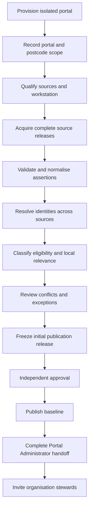

# Portal establishment and governance

Decision date: 24 September 2026.

Status: approved target architecture. This document defines the intended portal,
governance and release model. It does not claim that the current application
implements the model. The implementation differences are recorded in the
[gap analysis](portal-establishment-gap-analysis.md).

## Decision summary

1. Every portal has a separate database and security boundary. A deployment may
   use a separate Supabase project or another provider.
2. A portal's authoritative geographic scope is a versioned list of postcodes.
   An LGA name is descriptive and does not define the data boundary.
3. The owning or auspicing organisation appoints an application-level **Portal
   Administrator**. Technical database access remains with the platform operator.
4. Portal Administrators can edit unclaimed organisations automatically. Every
   such edit is audited. Continuing portal management after handoff requires an
   explicit stewardship state.
5. Initial publication and destructive or suppression releases require two
   different people. Ordinary update approval is configurable per portal.
6. An organisation-administrator invitation initially records an approval
   reference and note. Supporting documents may be added later without changing
   the core invitation workflow.

## Terminology and boundaries

### Portal

A portal is one independently deployed community directory and its complete data
plane: database, authentication population, private ingestion data, public records,
storage, secrets, schedules, policies and audit history. No portal workflow depends
on querying another portal's database.

The deployment boundary is the tenancy boundary. Domain and ingestion tables do
not need a `portal_id` column merely to reproduce a multi-tenant design inside each
database. Each database instead contains one immutable portal identity and
versioned portal configuration.

### Postcode-defined scope

The portal has a stable ID and a sequence of scope revisions. Each revision records:

- the exact canonical set of four-digit postcodes;
- its effective time and previous revision;
- the approving actor and reason;
- the inclusion-policy version;
- affected source configurations; and
- whether a new baseline campaign is required.

Postcodes define candidate discovery. They do not prove community relevance,
service delivery, legal identity or eligibility for publication. Each candidate
retains the evidence that brought it into scope, such as registered address,
service location, an explicitly known identifier or provider-specific locality.

A source snapshot can be compared for disappearance only with a complete prior
snapshot having compatible provider resource, parser, filter and scope revisions.
Changing the postcode set normally starts a re-baseline campaign rather than an
ordinary refresh.

### Provider portability

The application has one logical portal contract and may have multiple deployment
adapters. The current implementation can remain the first Supabase adapter. The
portable data contract is PostgreSQL-based because the current correctness model
depends on transactions, constraints, functions, triggers and row-level security.
Supporting a non-PostgreSQL database engine would be a separate rewrite, not a
configuration change.

Replaceable provider concerns are:

- PostgreSQL project or database provisioning;
- authentication and verified application identity;
- private artifact and document storage;
- secret management;
- scheduled jobs and worker execution;
- backups, recovery and health reporting; and
- deployment and migration execution.

Provider-specific SDK objects must not become the domain service interface. New
business workflows should depend on application-owned ports even where the first
implementation delegates to Supabase.

## Actors and authority

| Actor                             | Scope                           | Authority                                                                                                      |
| --------------------------------- | ------------------------------- | -------------------------------------------------------------------------------------------------------------- |
| Platform operator                 | Fleet                           | Provision, migrate, monitor, recover and retire deployments through the operations capability                  |
| Technical support operator        | One explicitly appointed portal | Time-bounded recovery or support; no implicit ordinary record-editing role                                     |
| Bootstrap release reviewer        | One portal establishment        | Prepare or independently approve the initial release; one person cannot do both                                |
| Portal Administrator              | One portal                      | Portal governance, invitations, policies, sources, releases and unclaimed or explicitly portal-managed records |
| Data Steward / Ingestion Operator | One portal                      | Acquire, validate, resolve identity and prepare change proposals within policy                                 |
| Organisation Owner                | One organisation                | Accept stewardship, manage organisation access and govern its record                                           |
| Organisation Administrator        | One organisation                | Manage permitted records and ordinary assignments within the role ceiling                                      |
| Organisation Editor or Member     | One organisation                | Bounded editing or reading                                                                                     |
| Ingestion worker                  | One portal machine identity     | Lease, acquire, stage and revalidate; cannot approve, publish or appoint people                                |

One person may hold more than one application role, but capabilities remain
separate. Where separation of duties is required, a second role held by the same
person does not satisfy the second approval.

The platform operator does not receive a permanent application assignment in every
portal. Exceptional application access uses an explicit support appointment with a
portal, reason, issuer, start and expiry. Direct provider access is separately
recorded as a technical operation.

## Portal lifecycle

The portal lifecycle is:

```text
planned
  -> provisioned
  -> scope_configured
  -> seeding
  -> seed_review
  -> initial_release_approved
  -> operational
  -> suspended
  -> retired
```

Every transition records its actor, reason, previous state and relevant artifact or
approval references. Invalid backward transitions require a distinct recovery or
re-baseline event; lifecycle history is not rewritten.

The Portal Administrator may be invited before initial publication so that the
sponsor can participate in approval, or after the technical seed is prepared. In
either case, the initial release still requires two distinct authorised reviewers
and administrative handoff is an explicit lifecycle event.

## Organisation stewardship

Imported publication never grants an ingestion operator ownership. Every
organisation has one of these stewardship states:

| State                | Meaning                                                          | Portal Administrator editing                   |
| -------------------- | ---------------------------------------------------------------- | ---------------------------------------------- |
| `unclaimed`          | No organisation representative has accepted responsibility       | Automatic                                      |
| `invitation_pending` | A stewardship invitation is active                               | Automatic until acceptance                     |
| `self_managed`       | An Organisation Owner has accepted responsibility                | No automatic access                            |
| `portal_managed`     | The organisation has authorised continuing portal management     | Allowed under the recorded authority           |
| `co_managed`         | Organisation and portal share explicitly recorded responsibility | Allowed under the recorded authority           |
| `suspended`          | Governance or security review blocks ordinary changes            | Only the specifically authorised recovery path |

Each state change is append-only evidence and records the approval reference, note,
effective time, actor and invitation or incident where applicable. `portal_managed`
and `co_managed` are deliberate governance decisions, not consequences of nobody
responding to an invitation.

Accepting an owner invitation atomically grants the organisation assignment and
changes stewardship to `self_managed` unless the invitation explicitly carries an
approved `co_managed` decision. The automatic Portal Administrator edit path then
ends without relying on session refresh.

## Invitations and appointments

Portal and organisation appointments begin with an invitation containing:

- invited email address;
- intended capability or role;
- portal or organisation scope;
- approval reference and note;
- inviter and issuing authority;
- issue and expiry times;
- single-use secret digest, never the clear token;
- accepted, expired, cancelled or superseded status; and
- append-only events.

Acceptance requires a verified registered account whose normalised verified email
matches the invitation. Acceptance is transactional and idempotent. Changing the
email, scope or role creates a new invitation rather than mutating approved intent.

An approval reference and note are required initially. Evidence documents may later
be attached using a private, access-controlled document capability and retention
policy; document upload is not required for the first invitation release.

## Establishment and initial seed



The isolated workstation receives a restricted credential for the selected target
portal. It can upload checksummed, versioned private artifacts through bounded and
replay-safe staging operations. It cannot approve publication, appoint users or
write portal records directly. Bootstrap credentials are revoked or rotated after
the establishment operation.

ABN, ACNC and state-register records remain distinct assertions. Identity
resolution groups them into a proposed canonical organisation without destroying
their source identity or provenance. Exact qualified identifiers may support
deterministic links. Shared ABNs, branches, services, conflicting identifiers and
weak name or address similarities remain review cases.

Large seed populations use policy classifications and exception queues. The design
does not require a person to review every discovered ABN individually. Publication
contains only the bounded, eligible and reviewed cohort.

## Campaign and release model

### Source release

An immutable observation from one provider with resource, parser, scope, licence,
checksums, completeness, observation time and retention evidence.

### Campaign

A coordinated unit of portal work. Types include:

- `initial_seed`;
- `scheduled_refresh`;
- `scope_rebaseline`;
- `manual_correction`;
- `withdrawal_response`; and
- `source_reprocessing`.

A campaign pins its source releases, portal scope revision, inclusion policy,
mapping versions and approval policy. It exposes stage readiness and counts but
does not itself publish data.

### Entity-resolution case

A reviewable proposal that one or more source identities represent a new legal
entity, an existing organisation, a branch or service, a duplicate, an exclusion or
an unresolved case.

### Change proposal

A field-level before/after proposal against a canonical target with source,
authority, observation dates, current revision, manual-edit protection, conflict
status and reviewer decision.

### Publication release

An immutable set of approved proposals. It records source releases, campaign,
submitter, approval revision, approvers, exact writes, failures, rollback boundary
and resulting portal revisions. Editing its contents invalidates approval and
creates a new release revision.

## Recurring updates

Recurring work reuses the same pipeline:

```text
acquire -> validate -> compare -> resolve identity -> propose changes
        -> review exceptions -> approve release -> publish
```

Default treatments are:

| Observation                                 | Treatment                                                     |
| ------------------------------------------- | ------------------------------------------------------------- |
| Exact repeat                                | No work item                                                  |
| New authoritative register fact             | Reviewable proposal                                           |
| Change to an unclaimed imported field       | Eligible for policy-based batch approval                      |
| Conflict with an organisation-managed value | Human review; never overwrite silently                        |
| New candidate                               | Inclusion and identity review                                 |
| Missing from a complete comparable snapshot | Mark missing or stale; do not delete                          |
| Register cancellation                       | Update that register status; do not infer operational closure |
| Explicit provider withdrawal                | Suppress affected publication and governed retained copies    |
| Partial or failed acquisition               | Diagnostic evidence only; no disappearance reconciliation     |

Automatic approval, if introduced, is field- and source-policy based and still
creates an attributable publication release. It never bypasses revision, source,
completeness, suppression or manual-edit protections.

## Approval policy

| Release class                      | Minimum approval                                                     |
| ---------------------------------- | -------------------------------------------------------------------- |
| Initial seed                       | Submitter plus a different approver                                  |
| Suppression or destructive release | Submitter plus a different approver                                  |
| Ordinary update                    | Portal-configurable one- or two-person approval                      |
| Emergency withdrawal               | Immediate authorised suppression plus mandatory retrospective review |

Destructive actions include hiding or archiving an organisation, removing a
published fact, withdrawing a source link, bulk replacement, a rollback that
affects later data, or a stewardship change that removes existing access.

Approval is revision-fenced. The publisher rechecks current source, target,
stewardship and approval revisions in the publication transaction. The submitter
cannot be counted as the independent approver.

## Administrative information architecture

The application separates responsibilities rather than putting every ingestion
operation on one page.

```text
Portal
  Overview and lifecycle
  Scope and policy
  Administrators and support appointments
  Audit and security

Data operations
  Campaigns
  Source releases and acquisition
  Validation issues
  Identity resolution
  Change review
  Publication releases
  Suppression and withdrawal

Organisation stewardship
  Unclaimed organisations
  Pending invitations
  Portal-managed organisations
  Self-managed organisations
  Access requests and handoffs
```

A campaign dashboard shows progress and blockers across stages. Each queue asks one
kind of decision. Raw evidence and provenance remain available but are secondary to
the decision being made.

## Fleet operations capability

The platform requires a control plane separate from every portal data plane. It
stores operational metadata, not community-organisation records or private source
evidence. Its functions are:

- register and provision a portal;
- select a provider adapter and region;
- apply and verify migrations;
- record application, schema and manifest versions;
- rotate application, worker and bootstrap credentials;
- configure health, backup and restore checks;
- issue and revoke time-bounded technical access;
- appoint or revoke the first Portal Administrator through an audited bootstrap;
- suspend or retire a portal; and
- export an operational audit package.

Every privileged operation records portal, operator, purpose or incident reference,
capability, start and expiry, result and affected deployment version. Secret values
remain in an approved secret manager and are referenced, not stored in the control
plane database.

An illustrative deployment manifest contains:

```text
portal_id
portal_manifest_version
application_version
schema_version
provider_adapter
provider_region
postcode_scope_revision
enabled_source_revisions
policy_version
created_at
```

## Invariants

- One portal deployment contains one portal identity.
- No source acquisition directly publishes portal data.
- Imported publication never grants ownership to an operator.
- A postcode match is discovery evidence, not inclusion evidence.
- Original source assertions and their provenance are not destroyed by merging.
- Partial snapshots cannot infer disappearance.
- Local or representative edits cannot be silently overwritten.
- Initial and destructive releases cannot be self-approved.
- Automatic unclaimed-record access ends atomically at self-managed handoff.
- Technical fleet authority is not ordinary portal-record authority.
- Provider changes do not weaken the portal's authorization, audit or publication
  invariants.
